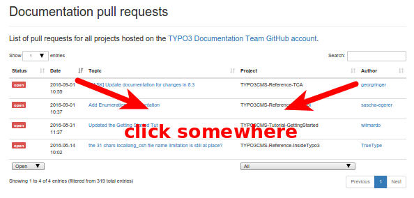


.. include:: ../Includes.txt

.. _contribute:

==========
Contribute
==========

How can you contribute?
=======================

Your help is very much appreciated - no matter what way you choose.
Ways to contribute:

*  The simplest way to contribute is by hitting the "Edit me on GitHub" button
   that sits in the top right corner of every page. This will create a fork in your
   own GitHub account, from which you can then create pull requests.

   .. figure:: ../Images/edit_me_on_github.png
      :alt: Edit me on GitHub icon
      :class: screenshot-detail

   If you are unfamiliar with GitHub, please refer to the `GitHub Help <https://help.github.com/>`__

*  Report issues for a specific manual at `GitHub <https://github.com/TYPO3-Documentation/>`__
   choosing the right manual.

*  You can contact the Documentation Team via their Slack channel "typo3-documentation"
   (if you are not on Slack yet, `get introduced <https://forger.typo3.org/slack>`__)
   or `send us an email! <documentation@typo3.org>`__

*  For anything else you may as well contact `Martin <martin.bless@typo3.org>`__.

.. _Are-there-open-pull-requests:

Are there open pull requests?
=============================

Sending pull requests (PR) at Github is the usual way to update documentation.
Visit our dashboard `GithubPullRequests <https://docs.typo3.org/services/GithubPullRequests/>`__
to get an overview of pull requests:

