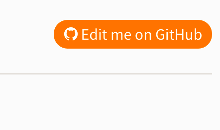


.. include:: ../Includes.txt

.. _contribute:

==========
Contribute
==========

How can you contribute?
=======================

Your help is very much appreciated - no matter what way you choose.
Ways to contribute:

Edit me on Github
-----------------

The simplest way to contribute is by hitting the "Edit me on GitHub" button
that sits in the top right corner of every page. This will create a fork in your
own GitHub account, from which you can then create pull requests.

If you are unfamiliar with GitHub, please refer to the `GitHub Help <https://help.github.com/>`__

Watch the official YouTube video `Tutorial - Contribute to
docs.typo3.org <https://www.youtube.com/watch?v=wNxO-aXY5Yw>`__
to get started.

More information: :ref:`h2document:docs-contribute`.

.. important::

   If you are familiar with git and docker, please consider using the
   :ref:`git / docker method <h2document:docs-contribute-quickstart>`.
   You will get better results for a rendering preview. And you might
   be more comforable using your preferred IDE / Editor than the
   Web GUI on Github.

Report Issues
-------------

Report issues for a specific manual at `GitHub <https://github.com/TYPO3-Documentation/>`__
choosing the right manual.

See `all open issues on Github <https://github.com/search?o=desc&q=org%3ATYPO3-Documentation+type%3Aissue&s=updated&state=open&type=Issues>`__
for TYPO3-Documentation.

Contact us
----------

*  You can contact the Documentation Team via their Slack channel "typo3-documentation"
   (if you are not on Slack yet, `get introduced <https://forger.typo3.org/slack>`__)
   or `send us an email! <documentation@typo3.org>`__

*  For anything else you may as well contact `Martin <martin.bless@typo3.org>`__.

Other methods
-------------

For more information, go to :ref:`h2document:how-to-contribute` in "Writing documentation".
