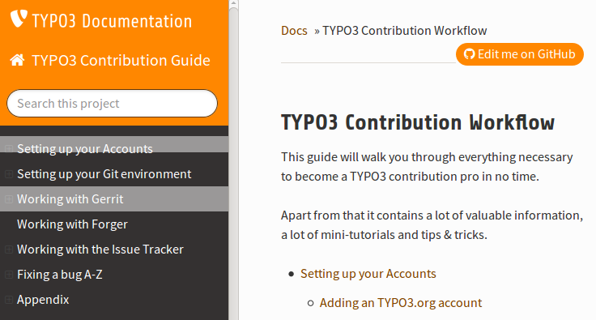
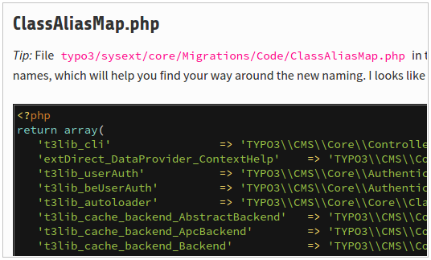

.. include:: /Includes.rst.txt

.. When creating a new year page, move the ".. _latest:" anchor to that page.

.. _news-2016:

====
2016
====

.. highlight:: shell

.. _news-2016-12-28:
.. rst-class:: panel panel-default

The ultimate explanation of optionSplit
---------------------------------------

2016-12-28 by Martin Bless

So you think you really understand what the TypoScript :typoscript:`optionSplit`
function does? Maybe, but better do a quick check:
What is the result of :typoscript:`wrap = a|*|r|||||||*|z`?
The wish to really understand :typoscript:`optionSplit` came up and in return
I reworked the :ref:`optionSplit chapter
<t3tsref:objects-optionSplit>` in the :ref:`TypoScript reference <t3tsref:start>`.
Hopefully it's the "ultimate explanation" of :typoscript:`optionSplit`.

Is there something still missing?

.. _news-2016-11-18:
.. rst-class:: panel panel-default

The FAL Reference has landed
----------------------------

2016-11-18 by François Suter

Until recently the :ref:`File Abstraction Layer Reference <t3fal:start>` was
pretty much an empty husk and users had to rely on a wiki page which was
not always up to date.

I have completely restructured the FAL Reference, with TYPO3 7 LTS
as a target version. I have completed every chapter and integrated everything
that was relevant from the wiki.

Please now use this official manual as reference and submit changes via
pull requests. The wiki page has been emptied.

.. _news-2016-11-07:
.. rst-class:: panel panel-default

Better explained: TCA type "flex"
---------------------------------

2016-11-07 by Christian Kuhn

I did a bigger change to the type=flex docs in TCA reference. I hope all the complex stuff is
explained a bit better in detail now. See `TCA, Pointing to a Data Structure
<https://docs.typo3.org/typo3cms/TCAReference/8-dev/ColumnsConfig/Type/Flex.html#pointing-to-a-data-structure>`__.

.. _news-2016-10-07:
.. rst-class:: panel panel-default

NEW: Doctrine Database API documented in CoreApi Manual
-------------------------------------------------------

2016-10-07 by Christian Kuhn

.. image:: files/2016-10-08-doctrine.png
   :alt: Go to new TYPO3 Doctrine Database Documentation
   :target: https://docs.typo3.org/typo3cms/CoreApiReference/Database/

For TYPO3 CMS version ≥ 8.3

**TYPO3 CMS v8** comes with a new database API based on `doctrine-dbal`_.
The core code has been fully migrated over the past months consuming uncounted
hours of community work.

**Documentation** of `doctrine-dbal`_ API within the TYPO3 ecosystem has just been
added to the official `TYPO3 API documentation`_ explaining all important
blows and whistles ready to be used since TYPO3 CMS **version 8.3**.

**Extension authors** are encouraged to switch their own extensions to the new
`Doctrine based database API`_. It comes with a much better abstraction of different
database platforms and it is an important foundation of further evolution.
Don't hesitate to push your database queries to this new level.

**Contribute:** And don't hesitate to use the "Edit me on Github" button
to improve the documentation.

Have fun!

.. _doctrine-dbal: http://www.doctrine-project.org/projects/dbal.html
.. _Doctrine based database API: https://docs.typo3.org/typo3cms/CoreApiReference/ApiOverview/Database/
.. _TYPO3 API documentation: https://docs.typo3.org/typo3cms/CoreApiReference/

.. _news-2016-10-05:
.. rst-class:: panel panel-default

TYPO3 Frontend Localization Guide updated
-----------------------------------------

2016-10-05 by Francois Suter

The :ref:`TYPO3 Frontend Localization Guide <t3l10n:start>` manual
was purged of many of its old parts this spring by Christopher,
but still remained out of date, in particular with regards to screenshots.
It is now fully up to date again for TYPO3 7. It is also restructured,
reflecting the fact that it has less content than before.

And now that it has proper anchors on every heading, I plan
to add relevant cross-links to it from quite a few other manuals.

.. _news-2016-09-14:
.. rst-class:: panel panel-default

Cool stuff for nerds: Special templates available!
--------------------------------------------------

2016-09-14 by Martin Bless

Admitted: This is an information for the very advanced reST user. But it's cool! I'm talking of
`t3SphinxThemeRtd <https://github.com/TYPO3-Documentation/t3SphinxThemeRtd>`__.
Usual pages are rendered from an html template
`page.html <https://github.com/sphinx-doc/sphinx/blob/master/sphinx/themes/basic/page.html>`__.
Now there are two more templates.
`sitemap.html <https://github.com/TYPO3-Documentation/t3SphinxThemeRtd/blob/master/t3SphinxThemeRtd/sitemap.html>`__
will fill in a complete sitemap after the contents. And
`extensions.html <https://github.com/TYPO3-Documentation/t3SphinxThemeRtd/blob/master/t3SphinxThemeRtd/extensions.html>`__
fills in the javascript driven search. The logic is in the
`module code of t3SphinxThemeRtd <https://github.com/TYPO3-Documentation/t3SphinxThemeRtd/blob/master/t3SphinxThemeRtd/__init__.py>`__.
It now has a new
`setup() <https://github.com/TYPO3-Documentation/t3SphinxThemeRtd/blob/master/t3SphinxThemeRtd/__init__.py#L45>`__
function that makes it a valid Sphinx extension as well besides being a theme. And in our
`conf.py <https://github.com/marble/typo3-docs-typo3-org-resources/blob/master/userroot/scripts/bin/conf-2015-10.py#L153>`__
we are loading `t3SphinxThemeRtd` as a Sphinx extension. As a result the
`file-wide-metadata <http://www.sphinx-doc.org/en/stable/markup/misc.html#file-wide-metadata>`__
of each document is checked. And if there's a field `template` its value is used as
templatename for the rendering of that document.

Are you still there?

See the `extensions page <https://docs.typo3.org/typo3cms/extensions/Index.html>`__ for example.
And look at `the source <https://docs.typo3.org/_sources/typo3cms/extensions/Index.txt>`__.
A sitemap `like this <https://docs.typo3.org/typo3cms/CoreApiReference/Sitemap/Index.html>`__
is another example. And again: Look at `the source <https://docs.typo3.org/typo3cms/CoreApiReference/_sources/Sitemap/Index.txt>`__.

I bet you noticed: That's a general mechanism opening new doors. Hooray!

.. _news-2016-09-07:
.. rst-class:: panel panel-default

TYPO3 Services Reference updated and expanded
---------------------------------------------

2016-09-07 by Francois Suter

The :ref:`TYPO3 Services References <t3services:start>` manual is finally up to date again
(for TYPO3 CMS 7). What's more it contains a whole new chapter
about authentication services. This chapter also describes the
TYPO3 CMS authentication process on a very general level, the
focus being on services.

.. _news-2016-08-31:
.. rst-class:: panel panel-default

Improved home page and menu structure
-------------------------------------

2016-08-31 by Francois Suter

At Martin's request - and after an exchange of ideas - I worked on
improving the content and layout of the docs.typo3.org home page.
This new version should be more useful and includes a side panel
with information for newcomers to TYPO3 CMS.

All others pages were also reviewed and quite a few were restructured
and improved, or placed in a more logical structure. This has
largely improved the main navigation on the left.

If you want to give some feedback, the best way is via the
"typo3-documentation" Slack channel.

.. _news-2016-08-05:
.. rst-class:: panel panel-default

Inside TYPO3 updated
--------------------

2016-08-05 by Francois Suter

The :ref:`Inside TYPO3 Reference <t3inside:start>`
is finally up to date for TYPO3 CMS 7. A lot of content was fully
rewritten, while many obsolete parts were removed.

Original news: https://forge.typo3.org/news/807

.. _news-2016-06-30:
.. rst-class:: panel panel-default

Improved Theme: Now it's version 3.6.0
--------------------------------------

2016-06-30 by Martin Bless

`Several issues <https://github.com/TYPO3-Documentation/t3SphinxThemeRtd/commit/e22dd5d567165dbad817a983fcae1dabdc3efab2>`__
with the theme are fixed now. And the `README of the repository
<https://github.com/TYPO3-Documentation/t3SphinxThemeRtd>`__
now has a pointer to the DEMO DOCS `t3SphinxThemeRtdDemoDocs
<https://docs.typo3.org/typo3cms/drafts/github/TYPO3-Documentation/t3SphinxThemeRtdDemoDocs/>`__
which are kind of a "stresstest" for the theme and demonstrate what's possible.

New: A `.. rst-class:: panel panel-default` right before a section (headline) will give it a Twitter-Bootstrap
-like "panel" styling as you can see on this page with the latest news.

New: The theme is version 3.6.0 now. Get it the regular way from `PyPi <https://pypi.python.org/pypi>`__
by doing:

`sudo pip install --upgrade t3SphinxThemeRtd`

Enjoy!

.. _news-typoscript-syntax-updated:
.. rst-class:: panel panel-default

TypoScript Syntax Reference updated
-----------------------------------

2016-05-31 by François Suter

The `TypoScript Syntax Reference <https://docs.typo3.org/typo3cms/TyposcriptSyntaxReference/>`__
is now up to date again for TYPO3 CMS 7. It was partly restructured
to remove redundancies and globally make for a more consistent reading.
Some obsolete parts were dropped.

Original news: https://forge.typo3.org/news/800

.. _news-typoscript-syntax-new-theme:
.. rst-class:: panel panel-default

TypoScript Syntax Reference has new outfit
------------------------------------------

2016-05-18

The `TypoScript Syntax Reference <https://docs.typo3.org/typo3cms/TyposcriptSyntaxReference/>`__
is coming along in the new theme now as well.

.. _news-tsconfig-new-theme:
.. rst-class:: panel panel-default

TSconfig Reference switched to new theme
----------------------------------------

2016-05-08

The `TSconfig Reference <https://docs.typo3.org/typo3cms/TSconfigReference/>`__ now has
the new theme as well.

.. _news-templating-tutorial-updated:
.. rst-class:: panel panel-default

Templating Tutorial updated
---------------------------

2016-05-12 by François Suter

The `Templating Tutorial (Basics)
<https://docs.typo3.org/typo3cms/TemplatingTutorial/>`__
is now up to date again.
More than refreshed, it was really refactored. This tutorial was accompanied by
files delivered via the extension called "doc_tut_templating". I have now made
this extension into a distribution, which makes it possible to deliver not only
the files but also a basic page tree with a few content element. This greatly
simplifies the early steps of the tutorial, which were redundant with the
Editors Tutorial.
I have reworked a lot of the content, which was quite verbose. It is now often
shorter and more to the point. I removed the chapter about "optionSplit",
which was confusing, and referred readers to the TypoScript Reference instead.
This ended up being a lot of work and this time I used all the time I had
planned in this budget milestone.
https://forge.typo3.org/news/799

.. _news-contribution-workflow-new:
.. rst-class:: panel panel-default

New Guide: Contribution Workflow
--------------------------------

2016-04-28

Yippie, we have a new guide:

.. _news-old-new-classnames:
.. rst-class:: panel panel-default

Old and new classnames
----------------------

2016-03-24 by Martin Bless

What are the new namespaced classnames that replace outdated old ones
of TYPO3 v4? You can now `find the answer in the documentation.
<https://docs.typo3.org/typo3cms/CoreApiReference/6.2/ApiOverview/Namespaces/Index.html#classaliasmap-php>`__

.. _surf-manual-moved:
.. rst-class:: panel panel-default

Surf manual has moved
---------------------

2016-03

The Surf manual has been moved to a new location. Old links get
redirected.

