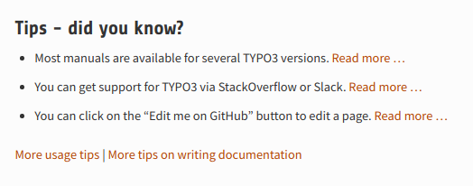

.. include:: /Includes.rst.txt
.. highlight:: shell

.. When creating a new year page, move the ".. _latest:" anchor to that page.
.. and add new year to News/Index.rst

.. _news-2019:

====
2019
====

.. note::

   Only major changes will be documented here. For all
   changes, see commit messages in respective
   `GitHub repositories <https://github.com/TYPO3-Documentation>`__.

.. _news-2019-08-19:
.. rst-class:: panel panel-default

New Chapters for "TYPO3 Explained"
==================================

*2019-08-19*

.. important::

   **Update:** 2020-01-02: For a more complete list, see :ref:`new_documentation`.

Several new chapters were added to "TYPO3 Explained".

API Overview:

* :ref:`Request Handling (PSR-15 / Middlewares) <t3coreapi:request-handling>`
* :ref:`t3coreapi:routing`
* :ref:`t3coreapi:seo`
* :ref:`t3coreapi:config-overview`
* :ref:`t3coreapi:flexforms`
* :ref:`t3coreapi:yaml-api`

Extension Development:

* :ref:`t3coreapi:composer-json`
* :ref:`t3coreapi:publish-extension`

.. _news-2019-08-09:
.. rst-class:: panel panel-default

New Chapters for Extbase / Fluid Book
=====================================

*2019-08-09*

Some documentation that was missing but is required for developer certification
version 9 was added:

* :ref:`Dispatching within Extbase (Request / Response) <t3extbasebook:dispatching>`

.. _news-2019-06-26:
.. rst-class:: panel panel-default

Deprecation of Extbase / Fluid Guide
====================================

*2019-07-01*

The "TYPO3 Extbase & Fluid Guide" is being deprecated and will soon be deleted.

Please use one of the following resources for information about Extbase / Fluid
and extension programming in general.

* There is an overview page with resources for developers in the
  :ref:`Getting Started Tutorial <next-steps-developers>`
* On that same page, there is a section "Fluid / Extbase"

The "Extbase / Fluid Guide" still contains the manually maintained Fluid ViewHelper
reference for TYPO3 8.7 and 6.2.

You can find links to all available ViewHelper references on the
`References <https://docs.typo3.org/Home/References.html>`__ page.

**The reasons for deprecation:**

* The "Extbase / Fluid Guide" had not been properly maintained and updated for a
  while
* Several unresolved issues
* Having a duplicate guide in addition to the "book" has been confusing people
* The current guide had not been a complete walkthrough and was missing some parts

**Plan for deprecation:**

#. phase 1: deprecation notice on every page
#. phase 2: remove and redirect (except ViewHelper reference for 6.2. and 8.7)
#. phase 3: removal all (ViewHelper refs will be redirected to automatically generated)

.. _news-2019-06-29:
.. rst-class:: panel panel-default

docs.typo3.org Gets New Infrastructure
======================================

*2019-05-29*

The documentation server docs.typo3.org moved to a new
infrastructure. `Read more ... <https://typo3.org/article/docstypo3org-gets-new-infrastructure/>`__.

Extension authors must migrate their documentation:

* :ref:`h2document:migrate`

.. _news-2019-05-09:
.. rst-class:: panel panel-default

Improvements for new TYPO3 users
================================

*2019-05-09 by Sybille Peters*

Some more changes were made to make it easier for people new to TYPO3
to find their way around the documentation:

* The tips on the start page used to address advanced documentation
  contribution. This has now been moved to :ref:`h2document:start` and
  more basic tips about TYPO3 and the documentation added, see
  `start page <https://docs.typo3.org>`__. This includes for example a
  link to the `help page on typo3.org <https://typo3.org/help>`__.

   Tips on start page

* A page :ref:`usage-tips` was added to help with some aspects of using TYPO3
  documentation that may not be obvious (:ref:`version selector <usage-version-selector>`,
  :ref:`structure <usage-structure>`, :ref:`navigation <usage-menu>`,
  :ref:`search <usage-search>`).
* The page :ref:`guides` was broken down into categories: for developers,
  editors, integrators etc.
  Not all manuals are relevant for each group and this will hopefully make
  it easier to find relevant material.
* Additionally, the page :ref:`guides` points to the subpages under "Next steps"
  in the "Getting Started Tutorial" for developers, integrators, etc. which
  contain additional tips on what to read next.

Thanks goes to Sybille Peters

.. _news-2019-05-09-2:
.. rst-class:: panel panel-default

"Getting Started Tutorial" updated for TYPO3 9.5
================================================

2019-05-09 by Sybille Peters

The :ref:`t3start:start` was updated for TYPO3 9.5.

Additionally, some more improvements were made:

* Language improvements for better readability
* Updated information in :ref:`Next steps <t3start:next-steps>`
  and added YouTube videos
* Formatting for better readability: Sections headlines, bold formatting, lists
* Drop-shadow for images

Thanks goes to Sybille Peters and Tom Warwick.

.. _news-2019-03-08-2:
.. rst-class:: panel panel-default

Improvements for Documentation Contributors
===========================================

2019-03-08 by Sybille Peters

If you are not yet familiar with contributing to the documentation at all,
we suggest you read the TYPO3 blog article
`Start Improving Docs Now to Grow TYPO3 <https://typo3.com/blog/start-improving-docs-now-to-grow-typo3/>`__
for an excellent introduction.

Meanwhile, we discovered that some information about contributing
was missing and parts of the information was spread out in too
many places. This made it difficult for a contributor to find things
or find out which of the information was relevant and up to date.

Because of this, we made several improvements.

These include additional chapters to the
manual :ref:`h2document:start` to help you get started, such as:

* :ref:`h2document:docs-contribute` : Main entry point for information about
  contributing and a walkthrough of editing with GitHub.
* :ref:`h2document:docs-contribute-git-docker`: This is an alternative
  to editing directly on GitHub for contributors familiar with Git and
  Docker.
* :ref:`h2document:rest-cheat-sheet`: Most often used formatting rules and directives,
  all on one page.
* :ref:`h2document:rest-common-pitfalls`: There are some traps you can
  fall into, when getting started with reST & Sphinx. This page shows
  the most common errors and should help you avoid them.
* :ref:`h2document:rendering-docs-troubleshooting`: When rendering locally
  with Docker, you might run into errors. This page should help you solve
  them.
* :ref:`how-to-contribute`: Contributors can pick from this list if they
  are looking for something to do.

You can start right away and learn as you go along, but if you are looking
for guidelines and best practices, we created an entire chapter
:ref:`general-conventions` for that. This includes:

* :ref:`Spelling Guide <h2document:spelling>`
* :ref:`guidelines-for-images`

We reduced duplicate information and try to link to one single entry point.

We also made some minor changes to make it easier for you to find things, like:

* The channel topic for **#typo3-documentation** now contains the date of the
  next Slack call.

.. figure:: files/slack_call.png
   :class:  with-shadow
   :target: https://typo3.slack.com
   :alt:    TYPO3 Slack call information
   :width:  50 %

   #typo3-documentation channel topic

* All repositories of main manuals now contain a `CONTRIBUTING
  <https://github.com/TYPO3-Documentation/TYPO3CMS-Reference-CoreApi/blob/latest/CONTRIBUTING.md>`__
  file. GitHub automatically displays a link to this, if you open a
  new issue or go to the issues tab as new contributor.

.. figure:: files/github-contributing2.svg
   :class: with-shadow
   :target: https://github.com/TYPO3-Documentation/TYPO3CMS-Reference-CoreApi/blob/latest/CONTRIBUTING.md
   :alt:    Link to CONTRIBUTING
   :width:  50 %

   Link to CONTRIBUTING for GitHub repository "TYPO3 Explained"

* We introduced the label `"good first issue" <https://github.com/issues?q=is%3Aopen%20is%3Aissue%20label%3A%22good%20first%20issue%22%20archived%3Afalse%20user%3ATYPO3-Documentation+no%3Aassignee>`__.
  This can be assigned to issues which are not very complex and can be solved by new contributors.
* All main manuals now contain a `README.rst <https://github.com/TYPO3-Documentation/TYPO3CMS-Reference-CoreApi/blob/latest/README.rst>`__
  with a link to the rendered documentation.

We hope that these changes will prove useful to you. There is still lots to do.
If you have additional suggestions, don't hesitate to write an `issue
<https://github.com/TYPO3-Documentation/TYPO3CMS-Guide-HowToDocument/issues/new>`__
or make the changes yourself.

Or tell us what works for you and what doesn't on :ref:`Slack <h2document:slack>`.

.. _news-2019-03-08:
.. rst-class:: panel panel-default

NEW: Documentation of Locking API
=================================

2019-03-08 by Sybille Peters

A chapter on the :ref:`t3coreapi:locking-api` is now available in
"TYPO3 Explained". This chapter has been written by Sybille Peters
and reviewed by Markus Klein.

You may have never been aware of the locking API because it works
under the hood in the TYPO3 core.

If you develop an extension and use the :ref:`t3coreapi:caching` or
have other issues where concurrent access to a resource must
be prevented, you should check it out.

As always, you can help to improve the documentation: Create an
`issue <https://github.com/TYPO3-Documentation/TYPO3CMS-Reference-CoreApi/issues/new>`__
or click the "Edit me on GitHub" button on the top right
of any page. Read :ref:`h2document:docs-contribute` in "Writing
Documentation" to find out more.

.. _news-2019-02-14:
.. rst-class:: panel panel-default

NEW: Documentation for rte_ckeditor
===================================

2019-02-14 by Sybille Peters

.. figure:: files/ckeditor.png
   :target: https://docs.typo3.org/typo3cms/extensions/rte_ckeditor/
   :alt:    A teaser screenshot
   :class:  float-left with-shadow
   :width:  50 %

Integration of CKEditor was introduced with TYPO3 8 LTS in the system extension
rte_ckeditor, thus replacing the previously used "HtmlArea".

Finally, documentation for this system extension was added to the core and is available to be
read `online <https://docs.typo3.org/typo3cms/extensions/rte_ckeditor/>`__.

Thanks goes to Benni Mack for writing the initial version of the documentation, Sybille
Peters for converting to reStructuredText and adding additional chapters and
Josef Glatz for further enhancing it.

The community is invited to participate in enhancing it:

* Join the channel #typo3-documentation on `Slack <https://typo3.slack.com>`__
  to ask questions (`Register <https://my.typo3.org/index.php?id=35>`__)
* Click "Edit me on GitHub" in the top right corner to make small changes
  (`Find out more ... <https://docs.typo3.org/typo3cms/HowToDocument/WritingDocsOfficial/Index.html>`__)
  or follow the :ref:`t3contribute:start`

.. rst-class:: horizbuttons-primary-m clear-both

- `rte_ckeditor Documentation <https://docs.typo3.org/typo3cms/extensions/rte_ckeditor/>`__
