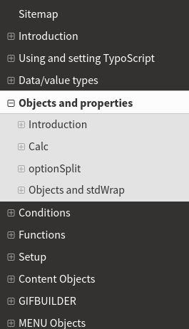
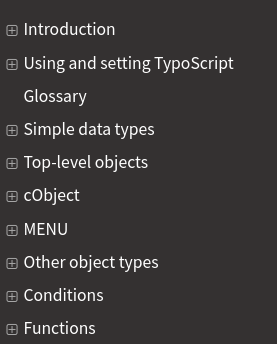

.. include:: ../../../../Includes.txt
.. highlight:: shell

.. When creating a new year page, move the ".. _latest:" anchor to that page.
.. and add new year to News/Index.rst

.. _latest:
.. _news-2020:

====
2020
====

.. _news-2020-typo3-explained-menu:
.. rst-class:: panel panel-default

"TYPO3 Explained" menu structure
================================

*2020-07-11 by Sybille Peters*

The menu of :ref:`t3coreapi:start` was considerably changed during and after
the Initiatives Week 2020.

The main goal was to make it easier to find and jump to a general topic.

To achieve this, the subchapters previously in :guilabel:`TYPO3 API overview`
were now moved to the top level. Previously we had several main topics in
:guilabel:`TYPO3 API overview`, some other main topics on the top level (such
as "Testing", "CGL" or "Security") and some smaller subtopics in
:guilabel:`API overview > Examples`. Also, the ordering in "TYPO3 API overview"
was partially alphabetical, partially not. Now we are using an alphabetical
ordering.

To see the "old" menu, look at the
`6.2 version <https://docs.typo3.org/m/typo3/reference-coreapi/6.2/en-us/ApiOverview/Index.html>`__
but please keep in mind that a number of additional chapter were added since
then. Specifically, several manuals (such as CGL, Security, Inside TYPO3)
were merged into "TYPO3 Explained".

Additionally, the menu was reorganized so that some smaller chapters are
now available via a general chapter:

* "TypoScript syntax", "TSconfig", "Global configuration", etc. are now
  subchapters of the new chapter :ref:`t3coreapi:configuration`.
* "MetaTag API", "PageTitle API" etc were moved to :ref:`t3coreapi:seo`.

While the change was generally met with approval, it does still have some
flaws and could use some more improvements.

For example, the menu is quite long which means you often have to scroll.
If you are in a subchapter that is on the bottom of the menu (for example
:ref:`"Upgrade wizards" <t3coreapi:update-wizards>`) and you are reading
a page, you have to scroll down to select a subchapter of the current
chapter from the menu.

This might be improved, if some more chapters were merged into main chapters.

Additionally, now some small and minor topics are in the top level menu.
This is usually due to the fact, that is not so easy to find a more general
category for a chapter or it could easily be expected to be found in
more than one category. Examples of these are:

* :ref:`t3coreapi:Enumerations`
* :ref:`t3coreapi:pagination`

These are some of the general navigational and structuring
questions that need to be addressed.

**What can you do to help?**

* Ideally create a proof of concept for a better structure and navigation concept
  for "TYPO3 Explained" or the documentation in general. You can
  `create a pull request <https://docs.typo3.org/m/typo3/docs-how-to-document/master/en-us/WritingDocsOfficial/LocalEditing.html>`__
  for this or `contact us on Slack <https://typo3.org/community/teams/documentation>`__.
* Look at the `open issue <https://github.com/TYPO3-Documentation/TYPO3CMS-Reference-CoreApi/issues/421>`__
  or all `issues <https://github.com/TYPO3-Documentation/TYPO3CMS-Reference-CoreApi/issues>`__ with label
  "content structure" in "TYPO3 Explained"

.. _news-2020-fluid-start:
.. rst-class:: panel panel-default

Fluid start page
================

*2020-03-12*

A :ref:`Fluid start page <t3coreapi:fluid>` was created in "TYPO3 Explained".
This reflects the importance of Fluid in TYPO3 and the multiple ways it is
now used in TYPO3. A :ref:`t3coreapi:fluid-introduction` subpage was added
as well.

The Fluid page serves as an overview of various ways to use Fluid in TYPO3
as Fluid is now no longer used only in developing Extensions with Extbase &
Fluid as was the case when it was initially introduced.

As **next steps** the documentation could be further restructured, moving
for example general Fluid information that is not specific to Extbase /
Fluid from the :ref:`t3extbasebook:start` to "TYPO3 Explained".

.. _news-2020-tsref:
.. rst-class:: panel panel-default

TypoScript Reference
====================

*2020-01-26*

We made several changes to the :ref:`TypoScript reference <t3tsref:start>` and documentation for the
topic TypoScript in general.

**Summary**

* Renamed to "TypoScript Templating Reference"
* Menu was restructured
* Consolidated older versions (finalized migration, ...)
* Added introduction, links to other information and quick links to start page

**In more detail:**

.. rst-class:: clear-both

Menu before and after restructuring

#. It was pointed out that the **"TypoScript Reference"** menu was confusing in parts:
   some functions (such as calc and objectSplit) were found under "Objects and Properties",
   top-level objects were hidden in a rubric "setup" etc. This resulted in things not
   being found where they were expected. We managed to simplify the menu and sort the topics accordingly.
#. The use of objects and object types was used inconsistently, some types were referred
   to as "objects" and vice versa. Especially, the term "cObject" was used inconsistently,
   sometimes to refer to the type, sometimes as synonym for "content objects". We corrected
   the use of these terms in some places and added a :ref:`glossary <t3tsref:glossary>`.
#. We renamed "TypoScript Reference" to "TypoScript Templating Reference" because the
   term TypoScript has 2 meanings and in this reference we mean TypoScript templating
   and not (primarily) TypoScript syntax (which is handled in :ref:`t3coreapi:typoscript-syntax-start`
   in "TYPO3 Explained". See `decisions.typo3.org <https://decisions.typo3.org/t/clarification-of-term-typoscript/560/9>`__
   for discussion about this topic.
#. The chapter "Introduction" contained no introduction into the topic - this is a common
   problem in the documentation: There is a chapter "Introduction" where you expect to
   find information about the topic or what the manual is about and often this only contains
   very little information about the manual, credits, how to give feedback etc. For this
   reason we renamed the current Introduction to "About this manual", moved it to the end
   of the menu and added a real :ref:`Introduction <t3tsref:introduction>`.
#. We linked to other manuals where topics are handled in depth (TypoScript in 45 minutes
   and "TypoScript syntax" in "TYPO3 Explained"), both on the start page and in the "Introduction"
#. We added the chapter "Using and setting TypoScript" to the older versions <= 8.7.
   Previously it only existed for versions 9.5 and master (10). (This is due to the fact
   that the migration of some manuals - like "TypoScript Syntax and in depth study"
   was done for version 9.5 and had not been
   performed for previous versions. This is now being done, step by step.)
#. We added "TypoScript Syntax" to older versions <= 8.7 in "TYPO3 Explained".
#. Added quick links to start page

**Further improvements:**

* The topic of using objects and objects types was addressed but could still be improved.
* Additionally, a number of pages could be improved. For example, the page FLUIDTEMPLATE
  could use a better introduction.

If you would like to help with this, please look at the
`open issues <https://github.com/TYPO3-Documentation/TYPO3CMS-Reference-Typoscript/issues>`__.

.. _news-2020-link-to-versions:
.. rst-class:: panel panel-default

Change in Intersphinx Linking
=============================

*2020-01-03*

When linking from one manual to another, we previously always linked to
the latest (master) version of the manual. For example, if you were
reading a section in "TYPO3 Explained" for TYPO3 version 8.7 and were
referred to the "TCA Reference" by clicking a link, you would continue
reading information for the latest TYPO3 version (currently, the
not yet released as LTS version 10.2). Changes between TYPO3
versions are minimal most of the time, but significant in some cases
(for example, see `Changelog for 9.0 <https://docs.typo3.org/c/typo3/cms-core/master/en-us/Changelog/9.0/Index.html>`__).

This caused the following problems:

* People who were aware of this but wanted to continue reading
  documentation for the same version had to click multiple times
  (to jump to the requested version) before continuing.
* Often, readers were not aware of this and did not notice the 
  change in version. They would then assume, the information 
  was correct for the version they started reading in.

Reading documentation on docs.typo3.org should not require knowledge
about such technical details. It should be possible to read and click,
regardless of how the documentation is separated into repositories.

These problems were pointed out in the #typo3-documentation Slack
channel, we created an `issue <https://github.com/TYPO3-Documentation/T3DocTeam/issues/81>`__
and now changed the procedure, so that links across manuals link
to the documentation for the **same TYPO3 version**.

.. figure:: ../../../Images/version-link.png
   :class: with-shadow

   Link to "TCA Reference" from "TYPO3 Explained" version 8.7

.. seealso::

   * :ref:`documentationTypo3Version`: Find out how documentation is available
     for several TYPO3 versions
   * :ref:`h2document:intersphinx`: More information about the intersphinx
     mechanism for cross-linking between manuals
