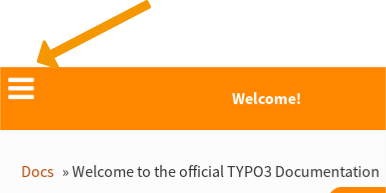
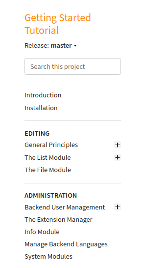
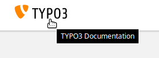
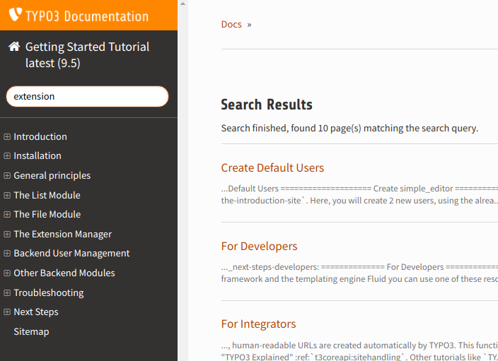
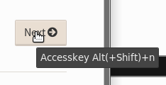

.. include:: ../../../Includes.txt

.. _usage-tips:

==========
Usage Tips
==========

.. _usage-structure:

General Structure
=================

The page you are currently reading is part of a few start pages we call **"glue pages"**.
From here, everything else is linked. The entire documentation is built out of individual
**"manuals"**. This can be an extension manual like
`ext:form <https://prod.docs.typo3.com/typo3cms/extensions/form/latest/>`__ or a tutorial
like :ref:`t3start:start`.

You can regard the "glue pages" as a special top-level manual which is used for information,
orientation and navigation.
Most manuals are linked to from the "glue pages", so you can use the "glue pages" to
find what you are looking for.

The "glue pages" **contain**:

* the start page https://prod.docs.typo3.com
* :ref:`tutorials`: A list of tutorials and guides
* :ref:`references`: A list of core documentation manuals, including :ref:`t3coreapi:start`
  and several references.
* this page and the entire :ref:`about-documentation` section
* ...

.. _usage-menu:

Menu
====

Menu of Glue Pages
------------------

When you are on one of the "glue pages" (for example this page or the start
page https://prod.docs.typo3.com), you can use the menu to navigate, for
example go to the :ref:`guides` page to select a guide or tutorial
or :ref:`extensions` to go to the documentation of an extension.

   Open menu of "glue pages" on mobile

.. figure:: _images/menu-glue-pages.svg
   :class: with-shadow

   Menu of "glue pages"

Menu of Other Manuals
---------------------

As soon as you go to a manual (e.g. :ref:`t3start:start`), you leave the "glue pages"
and the menu will look different:

* **On a glue page**: Menu of "glue pages", no search field
* **On a page of a manual**: Menu of the manual, search field

   Menu of "Getting Started Tutorial"

.. _usage-start-page:

Go to Start Page
================

Wherever you are, you can click :guilabel:`TYPO3 Documentation` in the top
left to return to the start page (click the image for an animated demo!):

.. editor's note: the target here has a different path because it points to
..                the image in the final, generated location

   Go to documentation start page https://prod.docs.typo3.com

.. editor's note: create invisible image here to make the file available
..                in the generated _images folder!

.. image:: _animatedgifs/home.gif
   :width: 0px
   :height: 0px

.. _usage-start-page-manual:

Go to the Start Page of a Manual
================================

When you are viewing a page of a manual (not the "glue pages"), you can
go to the start page of the manual by clicking on the title of the manual
(directly under :guilabel:`"TYPO3 Documentation"`).

.. figure:: _images/getting-started-menu-startpage.svg
   :class: with-shadow
   :alt: Go to start page of "Getting Started Tutorial"

   Go to start page of "Getting Started Tutorial"

.. _usage-version-selector:

Version Selector
================

When you are reading a manual, for example the :ref:`t3start:start`, you can select
a version from the version selector on the bottom of the menu: Click on :guilabel:`"Related Links"`
and then select a version. The version usually reflects the TYPO3 version, so for example
choose 8.7 if you are using TYPO3 8.7 LTS. Click the image for an animated demo!

.. editor's note: the target here has a different path because it points to
..                the image in the final, generated location. The target is
..                an animated gif.

.. figure:: _images/version-selector.svg
   :class: with-shadow
   :target: ../../_images/version-selector.gif

.. editor's note: Create invisible image here to make the file available
..                in the generated _images folder! This image is an animated
..                gif

.. image:: _animatedgifs/version-selector.gif
   :width: 0px
   :height: 0px

.. note::
   You cannot select a version from the page you are currently reading. The "glue pages"
   are not specific to a TYPO3 version.

.. _usage-search:

Search
======

The search box only searches in the selected manual. For example, if you are
reading :ref:`t3start:start`, then search will only search within this manual.

.. figure:: _images/search-box.png
   :class: with-shadow
   :alt: Search in a manual by using the search box

   Search in a manual by using the search box

.. figure:: _images/search-box2.png
   :class: with-shadow
   :alt: Type your search query in the search box

   Type your search query in the search box

   Click on one of the results

For a global search, use a search engine.

Restrict the search to `site:docs.typo3.org`, *if* you only want to search within
the official documentation on docs.typo3.org.

Just add your search query to one of these queries:

* `Google search: site:docs.typo3.org <https://google.com?q=site%3Adocs.typo3.org>`__
* `DuckDuckGo search site:docs.typo3.org <https://duckduckgo.com/?q=site%3Adocs.typo3.org&t=h_&ia=web>`__

.. _usage-browse-pages-by-keyboard:

Browse Pages by Keyboard
========================

Each manual knows about a linear sequence of its pages. Click on the buttons
:guilabel:`Next` or :guilabel:`Previous` to move forwards or
backwards in that sequence. The buttons are located on the bottom
of every page and on the top (in a smaller and more dimmed variant).

The good news is that these functions are also available
from the keyboard by the "access keys".

What's an "Access Key"?
-----------------------

  In a web browser, an `access key or accesskey`__ allows a computer
  user to jump to a specific part of a web page via the
  keyboard.

__ http://en.wikipedia.org/wiki/Accesskey

Unfortunately each browser seems to use `its own modifier`__ to
make the access key work.
In most web browsers the user invokes the access key by pressing
the "modifier (which often is :kbd:`Alt` or :kbd:`Ctrl`) simultaneously with the
appropriate character on the keyboard. So we have for example:

__ http://en.wikipedia.org/wiki/Accesskey#Access_in_different_browsers

================= ============================== =====================
OS                Browser                        Modifier
================= ============================== =====================
Linux             any                            :kbd:`Alt` + :kbd:`Shift`
OSX 10.6          Safari, Firefox, Chrome, iCab  :kbd:`Ctrl` + :kbd:`Alt`
OSX 10.7          Firefox                        :kbd:`Ctrl`
Win7              Chrome, Safari                 :kbd:`Alt`
Win7              Firefox                        :kbd:`Shift` + :kbd:`Alt`
Windows           IE                             :kbd:`Alt` + :kbd:`<character>` + :kbd:`enter`
================= ============================== =====================

.. tip::
   Hover over the :guilabel:`Next` or :guilabel:`Previous` button on the top
   or bottom of the page to see the tooltip.

Next Page
---------

Press :kbd:`access key` + :kbd:`n` or click :guilabel:`Next` to advance to the next
page in line.

Previous Page
-------------

Press :kbd:`access key` + :kbd:`p` or click "Previous" to go to the page that
precedes the current page.

.. image:: _images/previous.png
   :alt: click on 'next'
   :class: with-shadow

