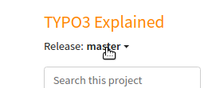

.. include:: /Includes.rst.txt

.. _whats_new:

==========
What's new
==========

.. _whats_new_slides:

What's new slides
=================

For each new major TYPO3 release, a set of
`"What's New Slides" <https://typo3.org/help/documentation/whats-new>`__
are created  in several languages, covering the **main** new features
and changes.

.. _whats_new_changelog:

Core Changelog
==============

Developers should regularly check the
`Core Changelog <https://docs.typo3.org/c/typo3/cms-core/master/en-us/>`__
for changes. In comparison to the "What's new Slides", this
is a **complete** list of deprecations, breaking changes and new features
in the core, written for a technical audience.

Additionally, the :ref:`extension scanner <t3coreapi:extension-scanner>`
is available in the TYPO3 backend (since 9.5) to check if existing extensions use
deprecated or removed functionality.

.. _documentationTypo3Version:

Documentation by TYPO3 version
==============================

Documentation that is rendered on docs.typo3.org often comes with several
versions. In the official documentation, each corresponds to a major TYPO3
version, for example 9.5.

You can see this in the URL, for example:

* ``/m/typo3/reference-coreapi/master/en-us/`` corresponds to the
  latest development branch "master" of TYPO3 which
  may contain information about yet unreleased changes.
* ``/m/typo3/reference-coreapi/9.5/en-us/`` corresponds to TYPO3
  version 9.5.

The version is also displayed along with the title.

You can jump to a different version of the manual by clicking on
the :ref:`version selector <usage-version-selector>` under the title.

We recently changed how we link across manuals. You will now
:ref:`be directed to the same version <news-2020-link-to-versions>`
(and not the latest - as before)
when you are reading documentation and come across a link to
another manual.

.. _DocsAvailableVersions:

Available versions
==================

We currently have the following policy:

* Official manuals are available on docs.typo3.org for
  all **ELTS versions and above**

For all available TYPO3 versions see https://get.typo3.org/.

.. _findDocsForOlderVersions:

Finding documentation for older TYPO3 versions
==============================================

Documentation that is :ref:`currently no longer available <documentationTypo3Version>`
on docs.typo3.org can still be accessed.

For example, "TYPO3 Explained" is rendered for versions 6.2 and above,
but older versions still exist for 4.5 and above.

You can find the older versions for official manuals by:

#. Find the manual on https://docs.typo3.org.
#. Click on the link :guilabel:`Repository` in the footer of the page.
   You should get directed to the GitHub repository.
#. Click on :guilabel:`Code > branches` and select the branch

You can now browse the files online on GitHub, but this will not be
rendered nicely, as not all sphinx directives are correctly rendered on GitHub.

To render the documentation locally (you need Git and Docker):

#. On the GitHub page, click on :guilabel:`Clone or download` to copy the
   repository URL
#. `git clone <repository-url>`
#. `cd <directory that was just created>`
#. `git fetch;git branch -a`
#. `git checkout <branch>`
#. Render the documentation, as described in :ref:`rendering-docs-quickstart`

.. whats-new-changes-in-documentation:

Changes in documentation
========================

Changes in TYPO3 documentation are announced via the following channels:

* `News on typo3.org <https://typo3.org/community/teams/documentation#c9876>`__:
  Used to report about events, used for announcement of major changes
* `Twitter T3DocTeam <https://twitter.com/T3docTeam>`__: Major and minor changes,
  give contribution tips
*  :ref:`news`: Describes changes that are announced on Twitter
* #typo3-documentation channel on Slack

.. _new_documentation:

New documentation
=================

Here is a list of documentation that was created recently:

.. _new_documentation_2020:

2020
----

* :ref:`t3coreapi:Events_JavaScript` (since TYPO3 10.3)
* :ref:`t3coreapi:ajax` was significantly rewritten for TYPO3 10
* :ref:`Fluid start page <t3coreapi:fluid>` (see also
  :ref:`news-2020-fluid-start` for description of change)
* :ref:`Fluid based emails <t3coreapi:mail>` (since 10.3)

.. _new_documentation_2019:

2019
----

Several new chapters were added to "TYPO3 Explained".

"TYPO3 Explained":

* :ref:`New documentation for translation with Crowdin <t3coreapi:xliff-translating-server-crowdin>`
  (in fact the entire :ref:`t3coreapi:internationalization` chapter has been heavily updated)
* :ref:`t3coreapi:DependencyInjection`
  for TYPO3 version 10
* :ref:`t3coreapi:be-layout`
  for TYPO3 version 10, 9, 8
* :ref:`t3coreapi:file_processing`
  for TYPO3 version 10
* :ref:`t3coreapi:broadcast_channels`
  for TYPO3 version 10
* :ref:`t3coreapi:deprecation`
  for TYPO3 version 10
* :ref:`t3coreapi:eventlist`
  for TYPO3 version 10
* :ref:`t3coreapi:EventDispatcher`
  for TYPO3 version 10
* :ref:`adding-your-own-content-elements` (moved from fluid_styled_content documentation)
  for TYPO3 versions :ref:`10 <adding-your-own-content-elements>`,
  `9.5 <https://docs.typo3.org/m/typo3/reference-coreapi/9.5/en-us/ApiOverview/ContentElements/AddingYourOwnContentElements.html>`__
  and `8.7 <https://docs.typo3.org/m/typo3/reference-coreapi/9.5/en-us/ApiOverview/ContentElements/AddingYourOwnContentElements.html>`__
* :ref:`t3coreapi:mail` (since 10.2)
* :ref:`Request Handling (PSR-15 / Middlewares) <t3coreapi:request-handling>`
  for TYPO3 versions :ref:`10 <t3coreapi:request-handling>`
  and `9.5 <https://docs.typo3.org/m/typo3/reference-coreapi/9.5/en-us/ApiOverview/RequestHandling/Index.html>`__
* :ref:`t3coreapi:routing`
  for TYPO3 versions :ref:`10 <t3coreapi:routing>`
  and `9.5 <https://docs.typo3.org/m/typo3/reference-coreapi/9.5/en-us/ApiOverview/Routing/Index.html>`__
* :ref:`t3coreapi:seo`
  for TYPO3 versions :ref:`10 <t3coreapi:seo>`
  and `9.5 <https://docs.typo3.org/m/typo3/reference-coreapi/9.5/en-us/ApiOverview/Seo/Index.html>`__
* :ref:`t3coreapi:config-overview`
  for TYPO3 versions :ref:`10 <t3coreapi:config-overview>`
  and `9.5 <https://docs.typo3.org/m/typo3/reference-coreapi/9.5/en-us/ApiOverview/Configuration/Index.html>`__
* :ref:`t3coreapi:flexforms`
  for TYPO3 versions :ref:`10 <t3coreapi:flexforms>`,
  `9.5 <https://docs.typo3.org/m/typo3/reference-coreapi/9.5/en-us/ApiOverview/FlexForms/Index.html>`__
  and `8.7 <https://docs.typo3.org/m/typo3/reference-coreapi/8.7/en-us/ApiOverview/FlexForms/Index.html>`__
* :ref:`t3coreapi:yaml-api`
* :ref:`t3coreapi:locking-api`

"TYPO3 Explained" Extension Development:

* :ref:`t3coreapi:composer-json`
  for TYPO3 versions :ref:`10 <t3coreapi:composer-json>`
  and `9.5 <https://docs.typo3.org/m/typo3/reference-coreapi/9.5/en-us/ExtensionArchitecture/ComposerJson/Index.html>`__
* :ref:`t3coreapi:publish-extension`
  for TYPO3 versions :ref:`10 <t3coreapi:publish-extension>`
  and `9.5 <https://docs.typo3.org/m/typo3/reference-coreapi/9.5/en-us/ExtensionArchitecture/PublishExtension/Index.html>`__

System extensions:

* `rte_ckeditor <https://docs.typo3.org/c/typo3/cms-rte-ckeditor/master/en-us/>`__
* `SEO <https://docs.typo3.org/c/typo3/cms-seo/master/en-us/>`__

Some documentation that was missing but is required for developer certification
version 9 was added to the "Extbase / Fluid Book":

* :ref:`Dispatching within Extbase (Request / Response) <t3extbasebook:dispatching>`

Writing Documentation for extension developers:

* :ref:`h2document:writing-doc-for-ext-start`
* :ref:`h2document:migrate`

Writing Documentation:

* :ref:`h2document:rest-cheat-sheet`
