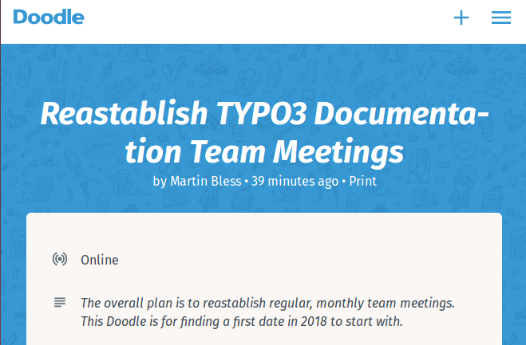

.. include:: ../../Includes.txt
.. highlight:: shell

.. When creating a new year page, move the ".. _latest:" anchor to that page.

.. _latest:
.. _news-2018:

====
2018
====

.. _news-2018-11-05:
.. rst-class:: panel panel-default

TYPO3 ViewHelper Reference
--------------------------

2018-11-05 by Daniel Siepmann

Done! A complete auto generated ViewHelper Reference is now available at
https://docs.typo3.org/typo3cms/ViewHelperReference/Index.html.

Right now, this is auto generated from TYPO3 CMS 9.5.1 source code, but
manually rendered and published. The plans are to automate this process and to
improve the source code documentation to provide a useful reference in the near
future.

The current state was achieved by joined forces. Claus Due developed the
generation. Anja Leichsenring did a great job on generating rst files out of the
generated information, which then could be handled like any other TYPO3
documentation.

Helping hands were Jan Suchandt and Johannes Seipelt working at 3m5.

.. _news-2018-10-13:
.. rst-class:: panel panel-default

TYPO3 Explained and more
------------------------

2018-10-13 by Christian Kuhn

Our ongoing efforts to integrate, streamline, simplify, modernize and structure the main
TYPO3 Core documents reached a next level: The well known "Core API" has been renamed to
:ref:`TYPO3 Explained <t3coreapi:start>`: This document gained more and more aspects over time
and many different ones have been merged into it. This has advantages for everyone:

* One main entry point: :ref:`TYPO3 Explained <t3coreapi:start>` becomes *the* main document where
  all main aspects of the TYPO3 Core can be found. You are getting less confused by all the existing
  other documents and references, TYPO3 Explained is *the* main thing to look at.

* It is much easier to maintain only one main repository: We learned that having tons of
  documentation repositories is rather hard to handle if certain parts of the TYPO3 Core
  change that need attention on the documentation side. We meanwhile managed to keep the
  reference documents updated, but other important documents often orphaned and contain
  outdated information. Having main parts in one place significantly simplifies this process.

* Better structures: We are aware that especially the :ref:`API Overview <t3coreapi:api-overview>`
  is getting longer and longer. But we're already looking at how this can be moved around
  and structured in a better way.

* Less duplication: We already streamlined at least four places where the main filesystem structure
  of the system has been explained. All in different documents. There are probably more places. This
  is true for other topics, too. And none of them is the real source of truth. Integrating repositories
  into :ref:`TYPO3 Explained <t3coreapi:start>` gives us the opportunity to merge this stuff around and
  streamline it once and for all. If we then maintain this stuff, it happens at one place and one place only.

How does all that materialize? Here are some of the works that happened already, with more
on the list:

* The "Security Guide" has been merged as :ref:`main chapter <t3coreapi:security>`. It comes with a
  modernization and overhaul. Go ahead and read or re-read it. It's an important chapter with tons of
  useful information.

* To make TYPO3 Explained v9 ready, Susanne Moog added an exhaustive chapter about the new
  :ref:`Site Handling <t3coreapi:sitehandling>` and routing. Great work! You really want to read that up
  if installing new TYPO3 instances or upgrading to TYPO3 v9.

* The new v9 :ref:`Meta tag API <t3coreapi:metatagapi>`, :ref:`Page title API <t3coreapi:pagetitle>` and
  :ref:`XML Site map <t3coreapi:xmlsitemap>` have been documented. Thanks to Richard Haeser for this
  incredible work!

* All added / changed properties of v9 are reflected in :ref:`TYPO3 Explained <t3coreapi:start>` and
  the reference documents already. Our workflow to review the `Changelog files
  <https://docs.typo3.org/typo3cms/extensions/core/latest/>`_ and merge relevant parts directly
  works out great. Special thanks to Anja Leichsenring for her continued efforts in this area!

* :ref:`TCA colums config reference <t3tca:columns-types>` got an update to better compare :php:`user`,
  :php:`passthrough` and :php:`none` types with each other.

* With integration of the saltedpasswords extension as direct core library, the
  TYPO3 Explained documentation has been extended with a new chapter about :ref:`password hashing
  <t3coreapi:password-hashing>`.

* The :ref:`Coding Guidelines chapter <t3coreapi:cgl>` of TYPO3 Explained got major additions by Sybille
  Peters. She is active in the documentation area at various places and for instance continuously
  improves the :ref:`Contribution workflow <t3contribute:start>` document. Thanks a ton for this!

* We see an increasing number of persons changing details of the documentation all over the place, too
  many to mention in person. This is great! We try our best to review pull requests in time and
  merge them. At the moment it seems we're able to cope with it. Keep up the good work and use
  the "Edit me on github" button in the top right corner, if you spot issues: Go ahead and improve!

* If you are interested in helping with TYPO3 documentation, you are invited to join the growing list
  of contributors. See :ref:`h2document:docs-contribute` for more information.

.. _news-2018-06-13:
.. rst-class:: panel panel-default

NEW: TYPO3 Site Package Tutorial
--------------------------------

2018-06-13 by Michael Schams

.. figure:: files/2018-06-13-site-package-tutorial.png
   :target: https://docs.typo3.org/typo3cms/SitePackageTutorial/
   :alt:    A teaser screenshot
   :class:  float-left with-shadow
   :width:  25 %

Today, the TYPO3 Documentation Team published a tutorial that describes the
steps required to turn a basic design template into a fully working,
mobile-responsive website.
`[Read more] <https://typo3.org/article/typo3-site-package-tutorial/>`__

.. rst-class:: horizbuttons-primary-m clear-both

- `Site Package Tutorial <https://docs.typo3.org/typo3cms/SitePackageTutorial/>`__

.. _news-2018-05-31:
.. rst-class:: panel panel-default

"Secret" plans of better documentation rendering
------------------------------------------------

2018-05-31 by Martin Bless

All this is about documentation published at `docs.typo3.org
<https://docs.typo3.org>`__.

Sometimes it's difficult to do all the necessary things simultaneously.
Informing the public is an easy candidate to be forgotten. Let's try to fix
this.

A small number of people met at the end of March 2018 in Düsseldorf. Main goals: Get an
overview of the current state and design a strategy for the "new documentation
server". Results of that meeting:

* The documentation team provides an improved and up to date Docker image that
  will serve as model for the server setup. It will be much smaller, since
  we drop the capability of reading OpenOffice files and the capability to
  generate LaTeX and PDF.

**Note: As of May 24, 2018 this first step has been achieved.**

Find the stripped-down version in the `develop-debian-html
<https://github.com/t3docs/docker-render-documentation/tree/develop-debian-html>`__
branch of the `t3docs/render-documentation
<https://github.com/t3docs/docker-render-documentation>`__ repository. The
master branch still has the OpenOffice and LaTeX-Pdf capabilities. I would
recommend it for local use.

**So development can now continue with the next steps:**

* The TYPO3 GmbH is offering to create a powerful automization solution based
  on that rendering recipe.

* Implementing a global "elastic" search will be part of that process. The
  documentation team contributes the necessary theme and rendering
  modifications.

* All rendering of manuals and extension manuals will be triggered
  based on hooks of their respective repositories. Automatically, instantly,
  fast, in parallel, with some rule-based automatic transformation of
  repository names to path names.

* Any developer can use the rendering chain by calling the proper hooks. These
  hooks will be developed in the process of creating the server automation.

* We don't publish PDF files any more.

* OpenOffice files are not valid documentation any more.

* We require that projects have a :file:`composer.json` file. Wherever possible
  we refer to this file to identify values. This means: The project name, the
  version number, allowed TYPO3 versions and so on, that appear in the
  documentation, will be taken from that :file:`composer.json` file.

* We will only publish documentation of extensions that are working with the
  currently maintained TYPO3 versions.

**Again: The Docker solution**

Coming back to the current `Docker solution for documentation rendering
<https://github.com/t3docs/docker-render-documentation>`__ - let me take the
chance to mention some highlights:

* improved typoscript highlighter
* packages (zip-archives) are smaller, due to excluded fonts an improved html
  font-stack
* Sphinx caching is enabled: for example, re-render the core ChangeLog in
  seconds, not 20 minutes or more
* contains a solution (in docs and in the 'show-shell-commands' code) for the
  'mtime' problem. Sphinx-caching is based on filetimes. The
  `git-restore-mtime
  <https://github.com/MestreLion/git-tools/blob/master/git-restore-mtime>`__
  script presents the solution for repositories.
* theme is up to date
* No Piwik calls in offline package
* YouTube directive works. But not in LaTeX. And that's not needed.
* The Sphinx extensions that we DO use are loaded by default. No need to
  mention them in Settings.cfg.
* Improvements in the toolchain

Keep on finding the words!

.. _news-2018-05-02:
.. rst-class:: panel panel-default

Revamped TSconfig Reference
---------------------------

2018-05-02 by Christian Kuhn

We modernized some of the main TYPO3 core documents with more than 100
single commits the last days:

* The old "Inside TYPO3" document is gone and all information has been merged into the
  :ref:`TYPO3 Core API <t3coreapi:start>`. The Core API document more and more evolves
  into **the** TYPO3 core documentation compendium where all conceptual core related
  information should be looked up in. The term "Core API" will probably change at
  some point to reflect this, too.

* The :ref:`TSconfig Reference <t3tsconfig:start>` received a major overhaul. This document
  is one of the most important documents next to the other two references, namely the
  :ref:`TypoScript Reference <t3tsref:start>` and the :ref:`TCA Reference <t3tca:start>`.
  The TSconfig Reference didn't receive too much love within the last years, but now it comes with
  a reworked menu structure, a lot of streamlined information and a simplified property listing
  with more examples. Various chapters have been moved around between the main core documents
  to make them more consistent and confined, readers should now find information at places
  they expect them to be.

.. _news-2018-03-28:
.. rst-class:: panel panel-default

Become a TYPO3 Documentation Team member
----------------------------------------

2018-03-28 by Martin Bless

We are about to re-establish regular, monthly online meetings of the TYPO3
Documentation Team. Please consider becoming a team member. This means: You are
willing to participate in the monthly meetings and you are willing to take over
a task or another on a regular and not just random basis. You have that
feeling? Great! Please get yourself a `Slack invite
<https://forger.typo3.com/slack>`__, if you haven't yet, and let us know
in the `#typo3-documentation channel
<https://typo3.slack.com/archives/C028JEPJL/p1522245664000027>`__.

And please, participate in this `Doodle
<https://doodle.com/poll/yk89nh4qk4kc3cii>`__ and vote for date and time of the
first meeting. To just join the meeting you don't need to become a member or
vote. Meetings are always open for guests.

Please vote: https://doodle.com/poll/yk89nh4qk4kc3cii

First possible dates are in the range of April 12-16, 2018.

.. _news-2018-02-13:
.. rst-class:: panel panel-default

HELP: My extension documentation was rendered with the OLD layout!
------------------------------------------------------------------

2018-02-13 by Martin Bless

That is actually a good sign. Why? Read on!

Shortly after an extension upload to the TER the documentation server will
render the documentation that (hopefully!) comes with that version.
BUT: At the moment this automatic rendering process still uses the old layout.
Unfortunately the current server is very old and can't run the new toolchain.
And we haven't managed to switch everything to a new server yet. That is why
you initially may feel you've done something wrong because that outdated
layout is used.
At the moment I'm running the new toolchain manually "every now and then" from my
local machine. In general that should happen at least once a day. The plan is,
of course, to set up a fully automated process for that. But we can't foresee
at the moment when exactly that will be.

What does this mean? If you see your documentation in the old layout that
actually is a good sign. It proofs that the documentation can be found and
rendered. Just stay calm and patient until the new layout appears. That's the
only thing you need to do.

Easy - you can do it!

.. _news-2018-02-02:
.. rst-class:: panel panel-default

New manual: "Tell me something about topic X"
---------------------------------------------

2018-02-02 by Martin Bless

Often questions are centered around topics: How does TYPO3
caching work? How can I improve performance? How to use
composer with TYPO3? And often answers are given in
blogpostings, slides, videos and so on.

`The new manual <https://docs.typo3.org/typo3cms/TellMeSomethingAbout/>`__
is the dedicated spot to list and collect
those topics. And it's up to you and everybody in the
community to come up with explanations, helpful texts
and links.

Can we make that manual a success? Yes, we can!
Everybody is counting on YOU!

.. _news-2018-01-20:
.. rst-class:: panel panel-default

Document restructurings
-----------------------

2018-01-20 by Christian Kuhn

Next to many contributors fixing various documentation parts,
we're currently in a bigger restructuring process of main
manuals: Various documents are merged into one,
the Homepage gets some love to find stuff quicker and other
good stuff.

Stay tuned!

.. _news-2018-01-19:
.. rst-class:: panel panel-default

Youtube Tutorial - Contribute to docs.typo3.org
-----------------------------------------------

2018-01-19 by Mathias Schreiber

.. youtube:: wNxO-aXY5Yw

