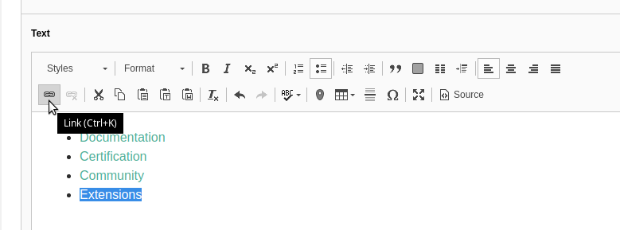

.. include:: ../../Includes.txt
.. highlight:: shell

.. When creating a new year page, move the ".. _latest:" anchor to that page.

.. _latest:
.. _news-2019:

====
2019
====

.. _news-2019-02-14:
.. rst-class:: panel panel-default

NEW: Documentation for rte_ckeditor
===================================

2019-02-14 by Sybille Peters

Integration of CKEditor was introduced with TYPO3 8 LTS in the system extension
rte_ckeditor, thus replacing the previously used "HtmlArea".

Finally, documentation for this system extension was added to the core and is available to be
read `online <https://docs.typo3.org/typo3cms/extensions/rte_ckeditor/>`__.

Thanks goes to Benni Mack for writing the initial version of the documentation, Sybille
Peters for converting to reStructuredText and adding additional chapters and
Josef Glatz for further enhancing it.

The community is invited to participate in enhancing it:

* Join the channel #typo3-documentation on `Slack <https://typo3.slack.com>`__
  `Register <https://my.typo3.org/index.php?id=35>`__ to ask questions
* Click "Edit me on GitHub" in the top right corner to make small changes
  (`Find out more ... <https://docs.typo3.org/typo3cms/HowToDocument/WritingDocsOfficial/Index.html>`__)
  or follow the :ref:`t3contribute:start`

.. rst-class:: horizbuttons-primary-m clear-both

- `rte_ckeditor Documentation <https://docs.typo3.org/typo3cms/extensions/rte_ckeditor/>`__
