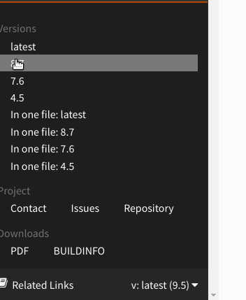
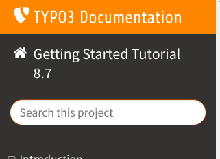

.. include:: ../../Includes.txt

.. _usage-tips:

==========
Usage Tips
==========

.. _usage-structure:

Structure
=========

The page you are currently reading is part of a few start pages we call "glue pages".
From here, everything else is linked. The entire documentation is built out of individual
"manuals". This can be, for example, an extension manual like
`ext:form <https://docs.typo3.org/typo3cms/extensions/form/latest/>`__ or a tutorial
like :ref:`t3start:start`.

When you are on the start page https://docs.typo3.org, you can use the menu to navigate
to one of the manuals, for example go to the :ref:`guides` page or :ref:`extensions`
to select an extension.

.. _usage-start-page:

Start Page
==========

Wherever you are, you can click :guilabel:`TYPO3 Documentation` in the top
left to return to the start page:

.. figure:: home.png
   :class: with-shadow
   :target: ../../_images/home.gif

   Click the image for a demo!

.. create invisible image here to make the file available in _images folder!

.. image:: home.gif
   :width: 0px
   :height: 0px

.. _usage-version-selector:

Version Selector
================

When you are reading a manual, for example the :ref:`t3start:start`, you can select
a version from the version selector on the bottom: Click on :guilabel:`Related Links`
and then select a version. The version usually reflects the TYPO3 version, so for example
choose 9.5 if you are using TYPO3 9.5 LTS.

   Click the image for a demo!

.. create invisible image here to make the file available in _images folder!

.. image:: version-selector.gif
   :width: 0px
   :height: 0px

.. note::
   You cannot select a version from the page you are currently reading. The start page and the "glue pages"
   are not specific to a TYPO3 version.

.. _usage-search:

Search
======

The search box only searches in the selected manual. For example, if you are
reading :ref:`t3start:start`, then search will only search within this manual.

For a global search, use a search engine like Google and restrict the
search to `site:docs.typo3.org`: `Google search: site:docs.typo3.org
<https://google.com?q=site%3Adocs.typo3.org>`__.

.. _usage-browse-pages-by-keyboard:

Browse Pages by Keyboard
========================

Each manual knows about a linear sequence of its pages. Click
:guilabel:`Next` and :guilabel:`Previous` to move forwards or
backwards in that sequence.

The good news is that these functions are also available
from the keyboard by the "access keys".

What's an "Access Key"?
-----------------------

  In a web browser, an `access key or accesskey`__ allows a computer
  user to jump to a specific part of a web page via the
  keyboard.

__ http://en.wikipedia.org/wiki/Accesskey

Unfortunately each browser seems to use `its own modifier`__ to
make the access key work.
In most web browsers the user invokes the access key by pressing
the "modifier (which often is :kbd:`Alt` or :kbd:`Ctrl`) simultaneously with the
appropriate character on the keyboard. So we have for example:

__ http://en.wikipedia.org/wiki/Accesskey#Access_in_different_browsers

================= ============================== =====================
OS                Browser                        Modifier
================= ============================== =====================
Linux             any                            :kbd:`Alt` + :kbd:`Shift`
OSX 10.6          Safari, Firefox, Chrome, iCab  :kbd:`Ctrl` + :kbd:`Alt`
OSX 10.7          Firefox                        :kbd:`Ctrl`
Win7              Chrome, Safari                 :kbd:`Alt`
Win7              Firefox                        :kbd:`Shift` + :kbd:`Alt`
Windows           IE                             :kbd:`Alt` + :kbd:`<character>` + :kbd:`enter`
================= ============================== =====================

.. tip::
   Hover over the :guilabel:`Next` or :guilabel:`Previous` button on the top
   or bottom of the page to see the tooltip.

Next Page
---------

Press :kbd:`access key` + :kbd:`n` or click :guilabel:`Next` to advance to the next
page in line.

.. image:: next+tooltip.png
   :alt: click on 'next'
   :class: with-shadow

Previous Page
-------------

Press :kbd:`access key` + :kbd:`p` or click "Previous" to go to the page that
precedes the current page.

.. image:: previous.png
   :alt: click on 'next'
   :class: with-shadow

