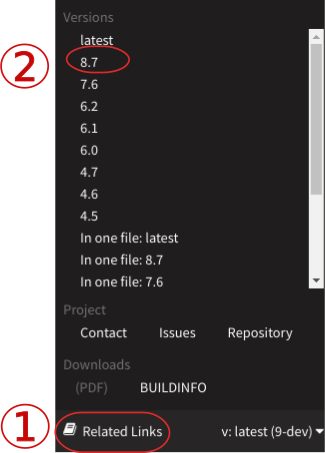

.. include:: ../../Includes.txt

.. _references:

==================
Core Documentation
==================

Place of the main TYPO3 core documentation, with :ref:`TYPO3 Explained <t3coreapi:start>`
being the head of everything.

Beginners may have an additional look at :ref:`the available tutorials <tutorials>`
depending on which task should be achieved.

.. t3-field-list-table::
 :header-rows: 1

 - :Manual:       Manual
   :Versions:     Links for TYPO3 versions
   :Description:  Description

 - :Manual:       :ref:`TYPO3 Explained <t3coreapi:start>`
   :Versions:     :ref:`latest <t3coreapi:start>` |
                  `v8.7 <https://docs.typo3.org/typo3cms/CoreApiReference/8.7/>`__ |
                  `v7.6 <https://docs.typo3.org/typo3cms/CoreApiReference/7.6/>`__
   :Description:  **The main document about TYPO3** Reading this is recommended for anyone.
                  This goes through all main aspects like installing, hosting, configuration,
                  security aspects and detailed programming API's. Single chapters are for
                  different target groups and outlined accordingly.

 - :Manual:       `Core ChangeLog <https://docs.typo3.org/typo3cms/extensions/core/latest/>`__
   :Versions:     `latest <https://docs.typo3.org/typo3cms/extensions/core/latest/Changelog-9.html>`__ |
                  `v8 <https://docs.typo3.org/typo3cms/extensions/core/latest/Changelog-8.html>`__ |
                  `v7 <https://docs.typo3.org/typo3cms/extensions/core/latest/Changelog-7.html>`__
   :Description:  New Features, Breaking Changes, Deprecations.
                  Reading up here is strongly recommended for developers.
                  For everyone else, the `What's new slides
                  <https://typo3.org/help/documentation/whats-new/>`__
                  provide the information in a more digestible way.

 - :Manual:       :ref:`t3tca:start`
   :Versions:     :ref:`latest <t3tca:start>` |
                  `v8.7 <https://docs.typo3.org/typo3cms/TCAReference/8.7/>`__ |
                  `v8.7 <https://docs.typo3.org/typo3cms/TCAReference/8.7/>`__
   :Description:  Reference for the Table Configuration Array (TCA). TCA can be
                  used to extend the definition of database tables.

 - :Manual:       :ref:`t3tsconfig:start`
   :Versions:     :ref:`latest <t3tsconfig:start>` |
                  `v8.7 <https://docs.typo3.org/typo3cms/TSconfigReference/8.7/>`__ |
                  `v7.6 <https://docs.typo3.org/typo3cms/TSconfigReference/7.6/>`__
   :Description:  Reference to Page TSconfig and User TSconfig. This is used
                  to configure the backend.

 - :Manual:       :ref:`t3tsref:start`
   :Versions:     :ref:`latest <t3tsref:start>` |
                  `8.7 <https://docs.typo3.org/typo3cms/TyposcriptReference/8.7/>`__ |
                  `7.6 <https://docs.typo3.org/typo3cms/TyposcriptReference/7.6/>`__ 
   :Description:  TypoScript is a configuration language that is specific to
                  TYPO3. This is used to configure the frontend.
                  For an introduction see the
                  :ref:`TypoScript in 45 Minutes <t3ts45:start>` tutorial.

 - :Manual:       :ref:`t3viewhelper:start`
   :Description:  A complete reference of all available Fluid ViewHelper within
                  TYPO3 CMS.

.. tip::

   Did you know, you can click on "Related links" at the bottom of a page in most
   manuals to select a different version. The versions of the manual correspond to the TYPO3
   version. For example, go to :ref:`t3coreapi:start` and select a different version.

**Outdated manuals**

With our ongoing consolidation efforts, some documents have been merged into other documents
for better overview, less duplication and confusion. The latest versions of these documents only
show a "Has been moved" message, but in case outdated information for older TYPO3 versions is looked
for, these obsoleted documents are listed here:

.. t3-field-list-table::
 :header-rows: 1

 - :Manual:       Manual
   :Description:  Description

 - :Manual:        :ref:`(OLD) Inside TYPO3 <t3inside:start>`
   :Description:   OLD, current core v9 version has been integrated into :ref:`TYPO3 Explained <t3coreapi:start>`

 - :Manual:       :ref:`(OLD) Core Coding Guidelines <t3cgl:start>`
   :Description:  OLD, current core v9 version has been integrated into :ref:`TYPO3 Explained <t3coreapi:cgl>`

 - :Manual:       :ref:`(OLD) TypoScript Syntax and In-depth Study <t3tssyntax:start>`
   :Description:  OLD, current core v9 version has been integrated into :ref:`TYPO3 Explained <t3coreapi:typoscript-syntax-start>`

 - :Manual:       :ref:`(OLD) Services API <t3services:start>`
   :Description:  OLD, current core v9 version has been integrated into :ref:`TYPO3 Explained <t3coreapi:services>`

 - :Manual:       :ref:`(OLD) File Abstraction Layer <t3fal:start>`
   :Description:  OLD, current core v9 version has been integrated into :ref:`TYPO3 Explained <t3coreapi:fal>`

 - :Manual:       :ref:`(OLD) Security <t3security:start>`
   :Description:  OLD, current core v9 version has been integrated into :ref:`TYPO3 Explained <t3coreapi:security>`

.. toctree::
   :hidden:

   TYPO3 Explained ➜   <https://docs.typo3.org/typo3cms/CoreApiReference/>
   Core Changelog    ➜ <https://docs.typo3.org/typo3cms/extensions/core/latest/>
   Tca ➜               <https://docs.typo3.org/typo3cms/TCAReference/>
   TSconfig ➜          <https://docs.typo3.org/typo3cms/TSconfigReference/>
   TypoScript Reference ➜ <https://docs.typo3.org/typo3cms/TyposcriptReference/>
   ViewHelper Reference ➜ <https://docs.typo3.org/typo3cms/ViewHelperReference/>
